# **Amazing-Articles**
The main purpose of this project is to provide good and informative articles to their curious readers. This project is developed using the MEAN stack.

It is a learning website for the readers, where users can 
* Read/write the articles,
* Search for the required article, 
* Save the article for future reference, 
* Explore various subjects,
* Share the article with others,
* Comment on any article.

Thus, **"Read, Learn & Grow"**.

## Project Demo Video : [Watch Amazing Articles in Action](https://drive.google.com/file/d/1Llqmyhz5HK5-4MxAUmDWgIdsxThlfOOP/view?usp=sharing)

## Features & Screenshots
1. Home page
<p align="center">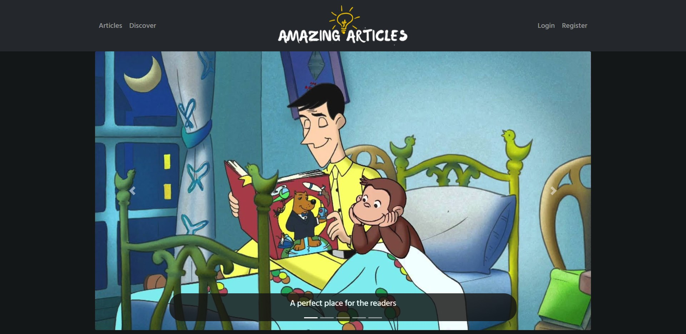</img></p>

2. Articles page
<p align="center">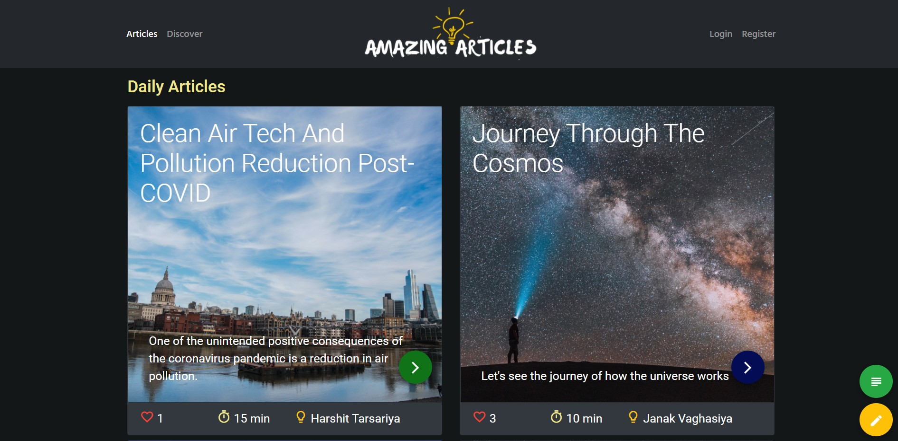</img></p>

3. Discover page
<p align="center">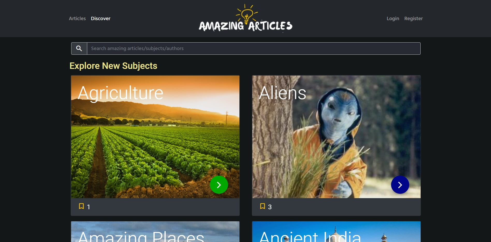</img></p>

4. Search article/subject by name of article, subject or author
<p align="center">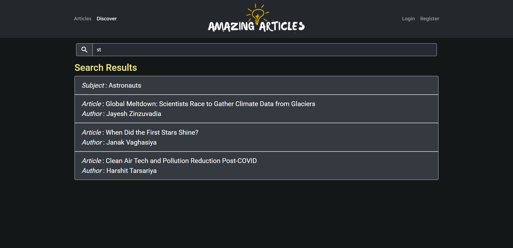</img></p>

5. Read article page
<p align="center">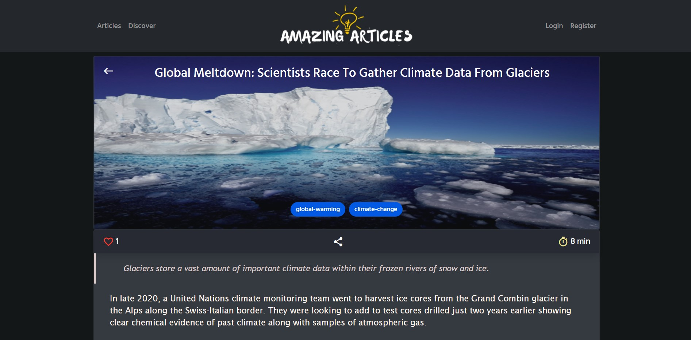</img></p>
<p align="center">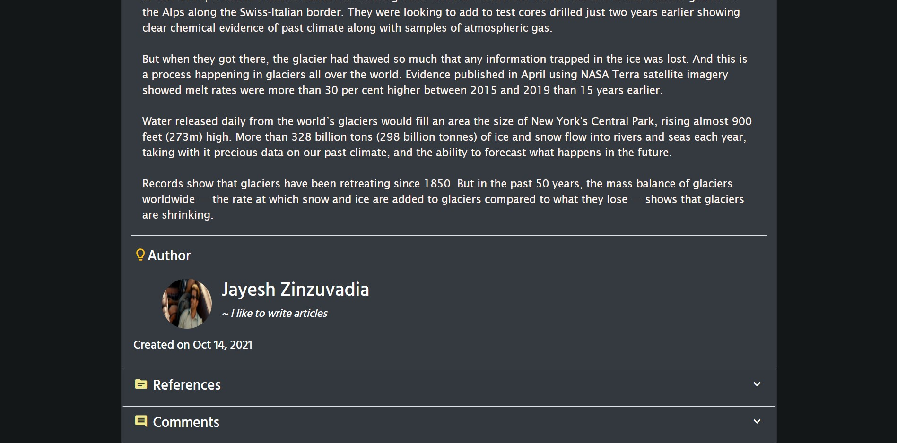</img></p>

- User can comment on the articles
<p align="center">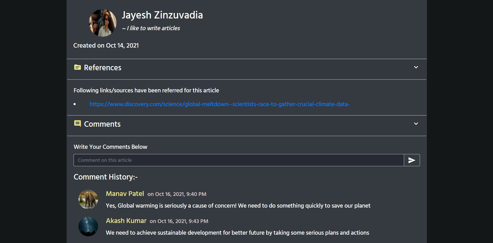</img></p>

- Dictionary support
<p align="center">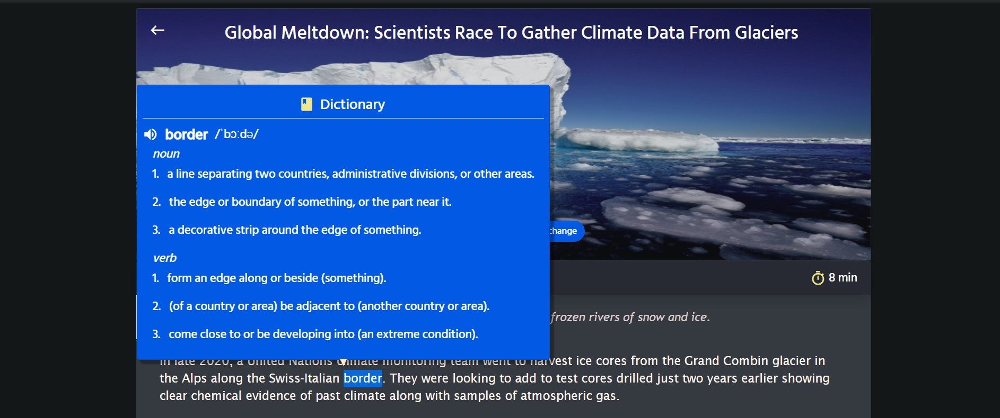</img></p>

6. Read subject
<p align="center">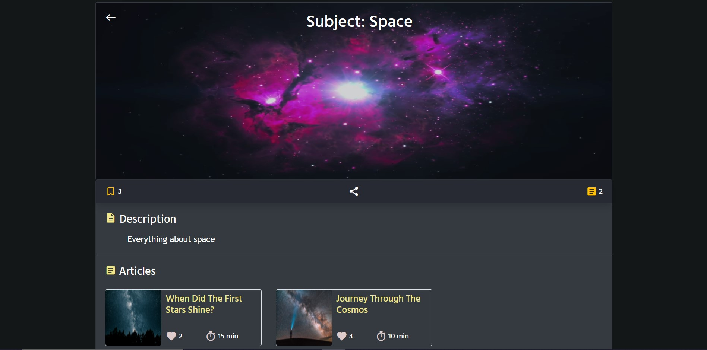</img></p>

7. Login page
<p align="center">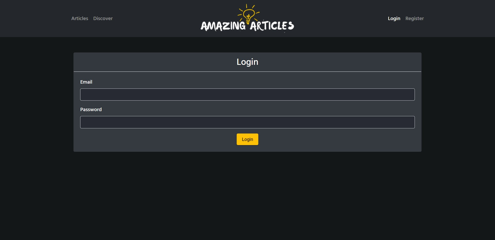</img></p>

8. Register page
<p align="center">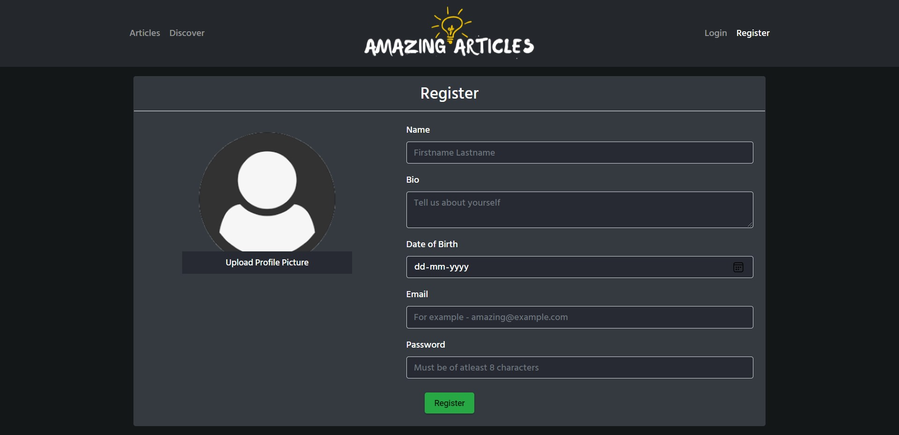</img></p>

9. Create new article page
<p align="center">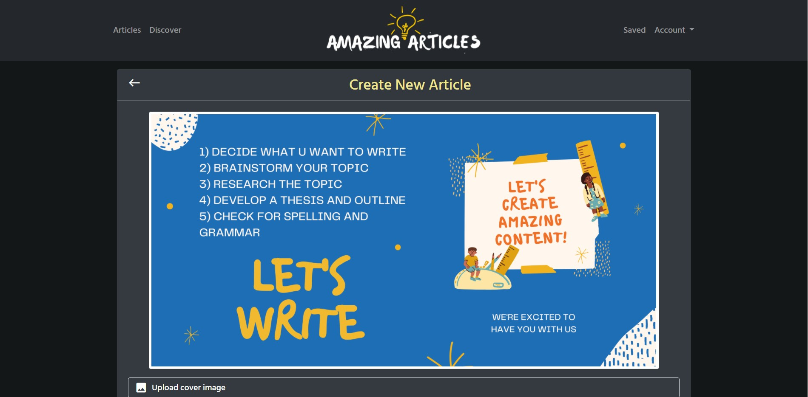</img></p>
<p align="center">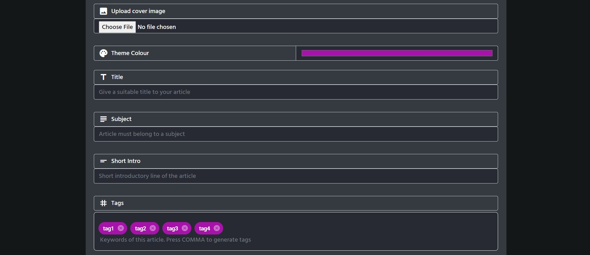</img></p>

10. Rich text editor for article content
<p align="center">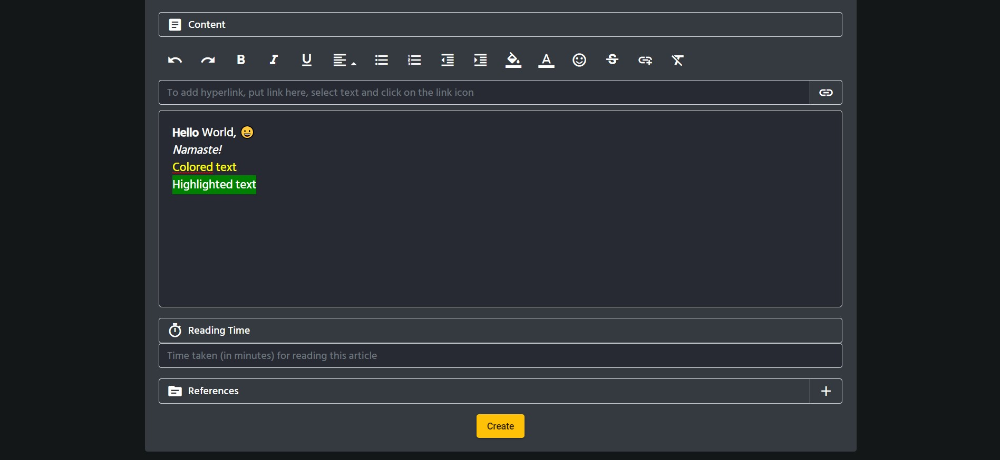</img></p>

11. Create new subject page
<p align="center">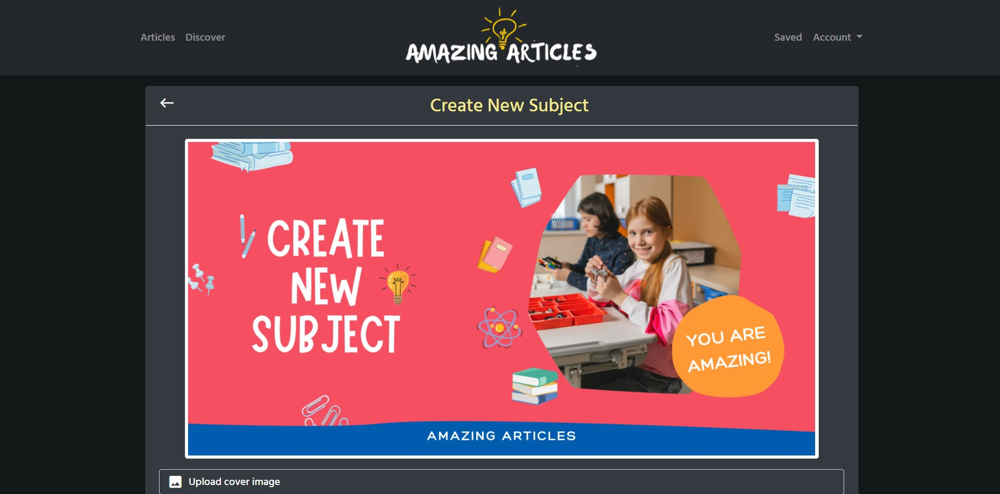</img></p>
<p align="center">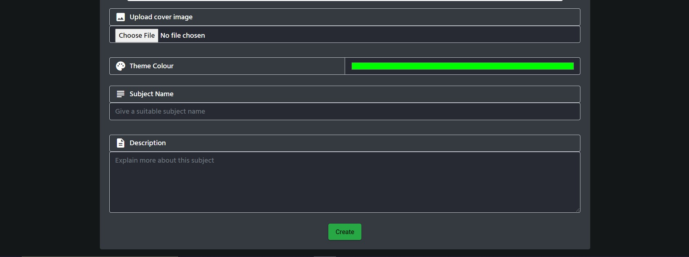</img></p>

12. Saved articles page - Articles liked by the user
<p align="center">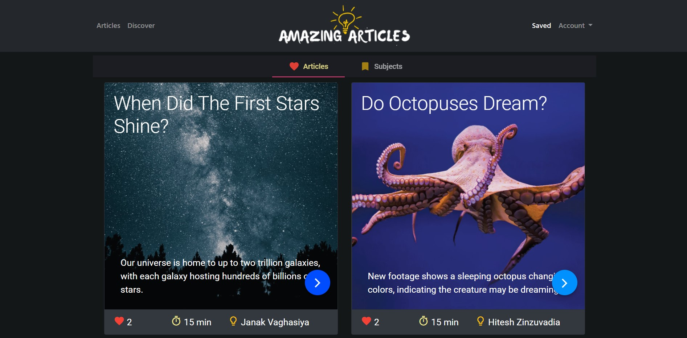</img></p>

13. Saved subjects page - Subjects followed by the user
<p align="center">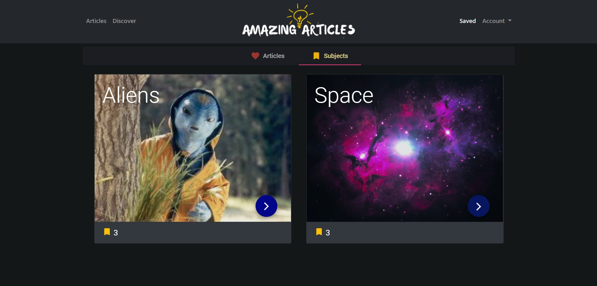</img></p>

14. My articles page - Articles written by the user
<p align="center">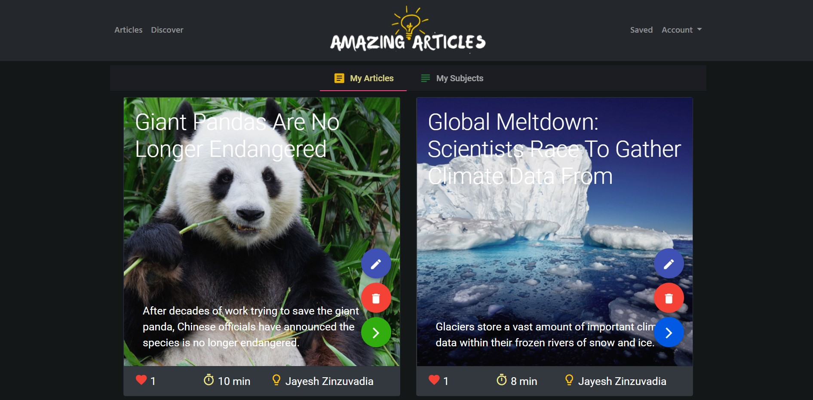</img></p>

15. User profile page
<p align="center">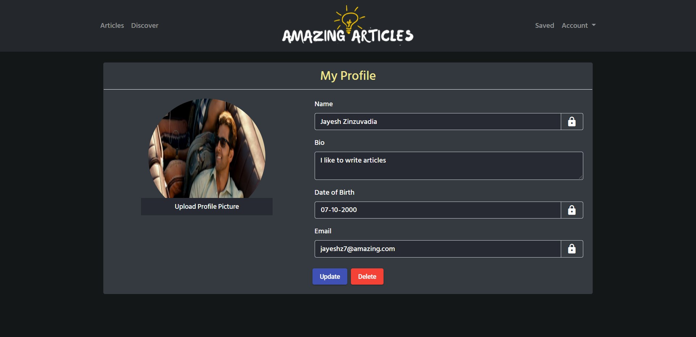</img></p>

## Implementation Detail
- For front end design:-

    1. [Angular](https://angular.io/docs)
    2. [Bootstrap 4](https://getbootstrap.com/docs/4.6/getting-started/introduction/)
    3. [Material Design by Google](https://material.angular.io/)
    4. [CSS](https://www.w3.org/Style/CSS/Overview.en.html)
    5. [Canva](https://www.canva.com/) for logo design

- For back end design:-

    1. [MongoDB](https://docs.mongodb.com/manual/introduction/) database
    2. [NodeJS](https://nodejs.org/en/docs/)
    3. [Express server](https://expressjs.com/)

- npm packages used:-

    1. express - For creating a server
    2. mongoose - For mongodb connection
    3. jwt - For user authentication
    4. multer - For file/image upload
    5. ng2-search-filter - For search functionality

## How to set up and run this project
**Note**: My Angular version is **10.2.0**, Node version is **12.18.2** and MongoDB version is **4.4.1**

Follow this steps:
1. Install the pre-requisites for the MEAN stack application.
2. Clone this repository and place the source code inside a particular folder.
3. Make sure that all the required packages are installed using the `npm install` command.
4. Run the backend
```
    cd .\server\
    mongod --dbpath="C:/data/db"
    node .\server.js
```
5. Run the front end angular application application
```
    cd .\amazing-articles\
    ng serve --open
```

## [References](https://github.com/jayeshzinzuvadia/Amazing-Articles/blob/main/references.txt)